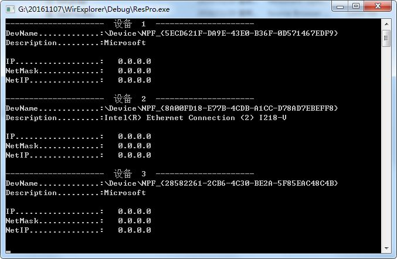

## WirExplorer Introduction

*WirExplorer 是一个用c++实现的对计算机网卡相关信息进行识别并获取的项目.*.

## Installation

运行环境需要visual studio 2015版本，低于此版本需要另外安装vc6.0相关库文件，此处不详细描述。

### Important Files

+ TastMain.cpp
+ StdAfx.h
+ ResPro.h

### Design

1. 一开始引入所需要用到识别并获取网卡信息的库文件

   `#include stdAfx.h`

   `#include ResPro.h`

2. 定义变量存储网卡信息

   	int devNum;       //设备总数目
   	pcap_if_t *dev;   //设备指针
   	in_addr *addr;    //数据转换媒介
   	int i = 0;        
   	//设备的ip地址、子网掩码，网络地址
   	u_long *ipAddr;
   	u_long *netmask;
   	u_long  netIP;

3. 获取设备列表

   ```devNum = resPro.FindAllDevs();```

4. for循环打印设备信息

   	printf("DevName.............:%s\n",dev->name);          //设备名字
   	printf("Description.........:%s\n\n",dev->description); //设备描述

5. 打印ip地址，子网掩码，网络地址

   	//  获取ip地址
   	addr   = (in_addr*)(&dev->addresses->addr->sa_data[2]);
   	ipAddr = (u_long*)addr;
   	printf("IP..................:\t%s\n",inet_ntoa(*addr));
   	
   	//  获取网络掩码
   	addr    = (in_addr*)(&dev->addresses->netmask->sa_data[2]);
   	netmask = (u_long*)addr;
   	printf("NetMask.............:\t%s\n",inet_ntoa(*addr));
   	
   	//  计算网络地址(二进制ip地址和二进制子网掩码进行逻辑运算->0&1=0;0&0=0;1&1=1;)
   	netIP   = (u_long)(*ipAddr) & (u_long)(*netmask);
   	addr = (in_addr*)&netIP;
   	printf("NetIP...............:\t%s\n\n",inet_ntoa(*addr));

### Running Result

 

### Demo Information

+ Github Adress : https://github.com/tczhangzhi/WirExplorer.git

### Contact

如果有使用的问题，可以联系

- Email : 564774252@qq.com
- mobile : 728891

### 免责声明

+ 此作品属于计算机与软件学院软件工程学生原创，在经的本人同意下编写此项目文档，并对项目进行分析。
+ 项目仍然在维护状态，持续更新请关注Github

